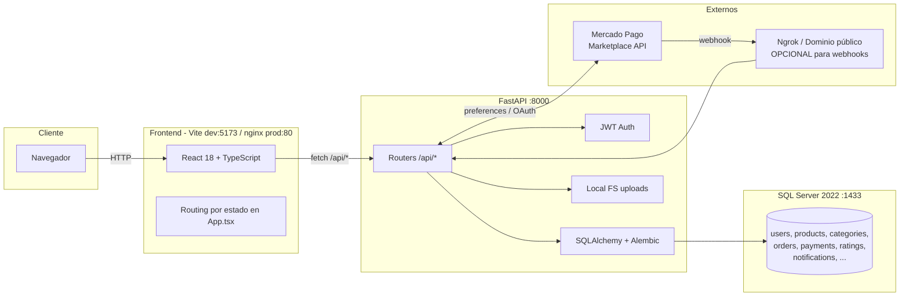
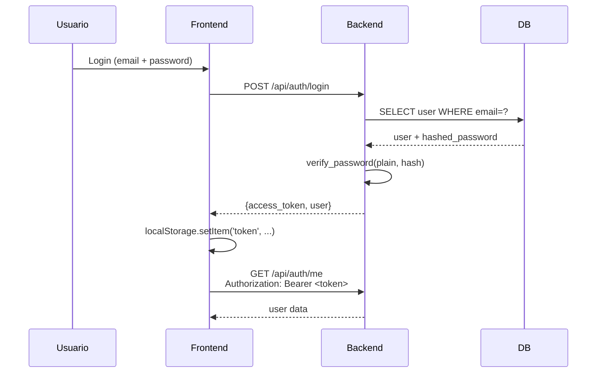
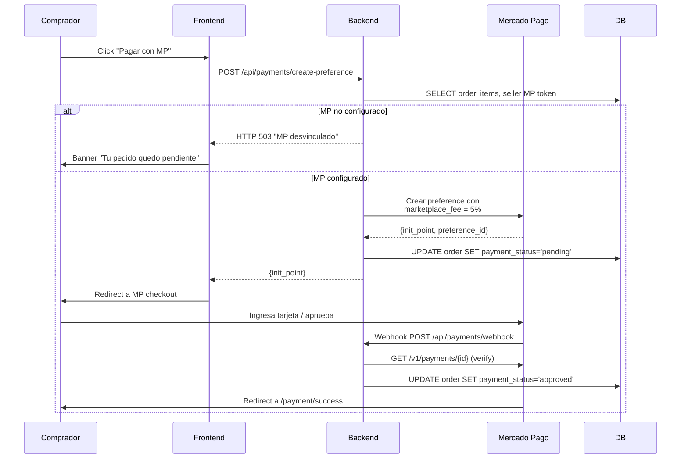

# Arquitectura — TopGreen / AgroMarket

## Vista general



---

## Stack técnico

### Frontend

- **Framework**: React 18 con TypeScript estricto.
- **Build**: Vite 5 (dev server con HMR en 5173, build a `dist/`).
- **Estado global**: Context API (`AuthContext`, `CartContext`, `ThemeContext`).
- **Routing**: routing por estado (sin react-router) — la "página actual" la maneja `App.tsx` con un enum.
- **HTTP**: `fetch` nativo + helper [`utils/api.ts`](../src/utils/api.ts) que inyecta `Authorization: Bearer <jwt>`.
- **Imágenes**: `` directos. Carrusel custom en `ProductDetail`.

### Backend

- **Framework**: FastAPI con Pydantic v2.
- **ORM**: SQLAlchemy 2.x (declarative).
- **Migraciones**: Alembic (11 migraciones, ver `backend/alembic/versions/`).
- **Auth**: JWT (HS256). Tokens con `ACCESS_TOKEN_MINUTES` (default 1440 = 24h).
- **Logging**: `structlog`.
- **CORS**: configurado por env `CORS_ORIGINS` (defaults para localhost).
- **Storage**: filesystem local (`/data/uploads`) en dev. `STORAGE_BACKEND` preparado para S3 / Cloudinary pero no implementado.

### Datos

- **Motor**: SQL Server 2022 Developer (gratuito para dev) en imagen Docker oficial.
- **Driver**: pyodbc + ODBC Driver 18 for SQL Server.
- **Connection string**: `mssql+pyodbc://sa:<pass>@<host>:1433/<db>?driver=ODBC+Driver+18+for+SQL+Server&TrustServerCertificate=yes`

### Pagos

- **Proveedor**: Mercado Pago Argentina (modelo Marketplace).
- **Modalidad**: Split Payments (5% TopGreen / 95% vendedor).
- **OAuth de vendedores**: cada vendedor vincula su cuenta MP desde su dashboard.
- **Webhook**: `/api/payments/webhook` — recibe notificaciones de pagos.
- **Estado actual**: **desvinculado** (todas las `MP_*` vacías). Ver
  [SETUP_PAYMENTS.md](SETUP_PAYMENTS.md).

---

## Flujo de autenticación



---

## Flujo de checkout (Mercado Pago Split Payments)



---

## Estructura de carpetas

```
topgreen-agromarket-phase1-delivery/
├── src/                      # Frontend React
│   ├── components/           # Componentes (Auth, Cart, Header, ...)
│   ├── contexts/             # AuthContext, CartContext, ThemeContext
│   ├── data/                 # mockData de fallback
│   ├── hooks/                # useProductFilters
│   ├── types/                # types globales
│   ├── utils/                # api.ts, formatters, catalogService
│   ├── App.tsx               # entry SPA + state-based routing
│   └── main.tsx              # bootstrap React + providers
├── public/                   # Assets servidos en raíz (favicon, videos)
├── backend/
│   ├── app/
│   │   ├── api/              # Routers (auth, products, cart, ...)
│   │   ├── core/             # config, security
│   │   ├── db/               # base / session
│   │   ├── middlewares/      # logging, etc.
│   │   ├── models/           # SQLAlchemy ORM
│   │   ├── schemas/          # Pydantic
│   │   ├── services/         # lógica de negocio
│   │   ├── main.py           # bootstrap FastAPI
│   │   └── seed.py           # datos demo
│   ├── alembic/              # migraciones
│   ├── tests/                # tests pytest (escasos)
│   ├── Dockerfile
│   └── requirements.txt
├── infra/
│   └── nginx/conf.d/         # config nginx (frontend buildado)
├── docs/                     # documentación de la entrega
├── scripts/                  # scripts de inicialización
├── uploads/products/         # imágenes subidas (vacío en delivery)
├── docker-compose.yml        # db + api (+ nginx opcional con perfil)
├── package.json              # frontend deps
└── README.md
```

---

## Decisiones técnicas relevantes

| Decisión | Razonamiento |
|----------|--------------|
| SQL Server (no PostgreSQL) | Requerimiento del cliente original. La imagen Docker oficial es gratis para dev. |
| Routing por estado (no react-router) | Decisión inicial del equipo. SPA simple. Reconsiderar en Fase II si crece. |
| JWT en localStorage | Funciona, pero vulnerable a XSS. Considerar httpOnly cookies en producción. |
| Storage filesystem local | Solo válido en dev. Migrar a S3/Cloudinary en producción. |
| Sin tests E2E | No se priorizaron en Fase I. Recomendado agregar Playwright/Cypress. |
| Hot reload con `volumes: ./backend/app:/app/app` | Cómodo en dev. Quitar en imagen de producción. |
