# Guía del panel de administración — AgroBoeda

Esta guía es para quien administra AgroBoeda. Explica cada parte del panel de
administración: qué muestra, qué se puede hacer, qué no se puede hacer y qué
pasa después de cada acción.

Cada paso de esta guía se comprueba con un programa que la recorre en el
navegador y hace lo que el paso dice. Si el panel cambia y la guía queda
desactualizada, ese programa falla y dice en qué paso. Cómo correrlo, y lo
que no comprueba, está al final.

Los textos entre comillas latinas, como «Usuarios», son exactamente lo que se
ve en la pantalla: botones, pestañas, títulos y mensajes.

## Antes de empezar: lo que el panel no hace

Hay cosas que conviene saber antes de tocar nada, porque son límites de la
plataforma y no se cambian desde el panel.

- **La plataforma no cobra, no recibe ni guarda dinero de las ventas.** Quien
  compra le paga directamente a quien vende, por Mercado Pago o por
  transferencia. Los montos que muestra el panel son información: nada de
  ese dinero pasa por AgroBoeda.
- **Las transferencias las confirma quien vende**, mirando su propia cuenta
  bancaria. Desde el panel no se puede aprobar ni rechazar un pago.
- **Las órdenes sólo se miran.** Desde el panel no se cambia el estado de una
  orden ni se cancela.
- **La revisión de documentación es informativa.** Aprobarla agrega un
  distintivo en las publicaciones del vendedor. No habilita ni bloquea
  publicar, vender ni cobrar, y no certifica su identidad.
- **Los teléfonos no se publican.** En el Mercado y en las fichas no aparece
  el teléfono de nadie. El contacto se comparte dentro de una operación:
  - quien compra y quien vende ven el del otro en su orden;
  - quien compra ve el del transportista después de elegirlo;
  - el transportista no recibe el contacto de quien compra.
- **Suscripciones y planes: PENDIENTE.** Todavía no existen. El panel no
  tiene cómo activar una suscripción, y el acceso a contactos por plan no
  está definido para esta etapa.
- **Nadie recibe un aviso de lo que se cambia desde el panel.** Si pausás una
  publicación o desactivás una cuenta, la persona no recibe ningún mensaje.
- **Tu propia cuenta no se toca desde el panel.** No podés desactivarte ni
  quitarte el acceso de administración: lo tiene que hacer otra persona
  administradora.
- **Las marcas no se administran desde este panel.** Las marcas que se
  ofrecen al publicar maquinaria no están entre las listas de
  «Configuración».

## Cuentas de prueba

En la base de prueba existe la cuenta de administración
`admin@topgreen.com`, con la contraseña `admin123`. **Es pública**: está
escrita acá y en el código. Sirve sólo para la base de prueba y **se cambia
antes de poner la plataforma en producción.**

---

## 1. Entrar al panel

### Paso 1. Abrir el panel
<!-- recorrido: entrar -->

1. En la cabecera, tocá «Ingresar» y entrá con una cuenta de administración.
2. En la cabecera aparece el botón «Admin». Tocalo.
3. Se abre el «Panel de Administración», con siete pestañas: «Dashboard»,
   «Usuarios», «Productos», «Órdenes», «Categorías», «Documentación» y
   «Configuración».
4. Para cerrarlo, tocá la cruz «×» de arriba a la derecha, o apretá la tecla
   Escape.

El botón «Admin» sólo aparece para cuentas de administración. En el celular
es igual: las siete pestañas entran en la pantalla.

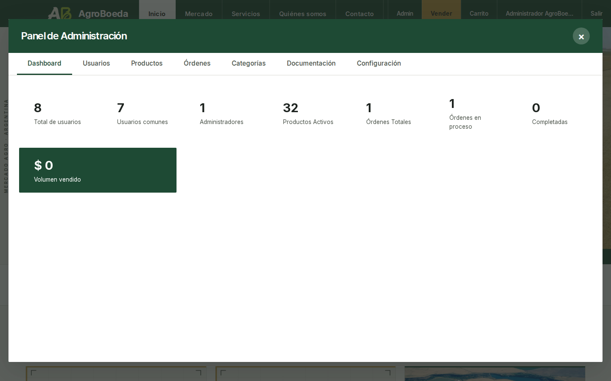
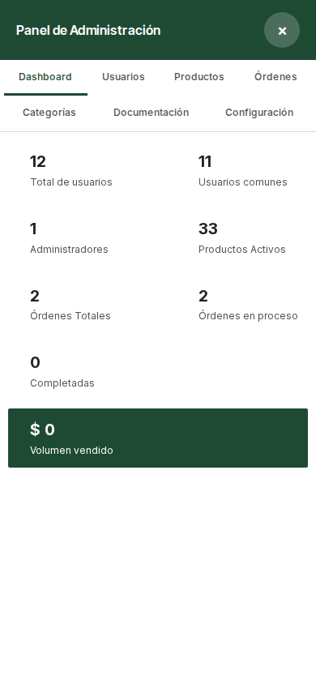

---

## 2. Dashboard: el resumen

### Paso 2. Leer el resumen
<!-- recorrido: resumen -->

La pestaña «Dashboard» es la que se abre primero. Muestra ocho números:

- «Total de usuarios»: todas las cuentas, activas o no.
- «Usuarios comunes»: las cuentas que no son de administración.
- «Administradores»: las cuentas de administración.
- «Productos Activos»: las publicaciones que hoy se ven en el Mercado.
- «Órdenes Totales»: todas las órdenes, en cualquier estado.
- «Órdenes en proceso»: las que están pedidas, confirmadas, esperando o
  revisando un comprobante, pagadas o enviadas.
- «Completadas»: las entregadas.
- «Volumen vendido»: la suma de las órdenes pagadas, enviadas o entregadas.
  Ese dinero fue de quien compró a quien vendió; la plataforma no lo recibió.

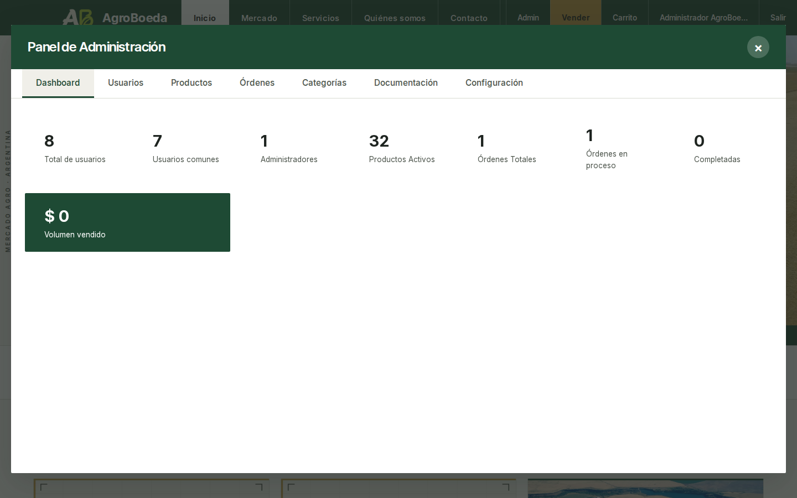

---

## 3. Usuarios

### Paso 3. Buscar y filtrar cuentas
<!-- recorrido: usuarios-buscar -->

1. Abrí la pestaña «Usuarios».
2. Para buscar a alguien, escribí parte del nombre o del correo en «Buscar
   por nombre o email» y tocá «Buscar».
3. Para filtrar, usá los selectores:
   - por rol: «Todos los roles», «Administradores» o «Usuarios»;
   - por estado: «Activos e inactivos», «Solo activos» o «Solo inactivos».

La tabla muestra «Nombre», «Email», «Rol», «Estado», «Registrado» y
«Acciones». Si ninguna cuenta coincide, dice «No hay usuarios que coincidan
con el filtro.». Muestra veinte cuentas por página. Abajo dice el total, como «Total: …
usuarios», y la página, como «Página … de …», con los botones «Anterior» y
«Siguiente».

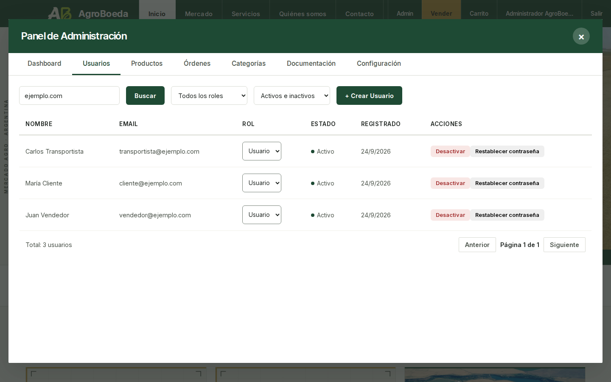
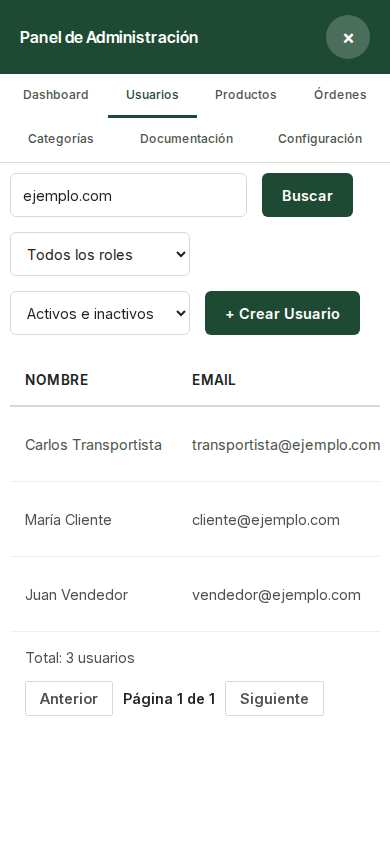

### Paso 4. Crear una cuenta
<!-- recorrido: usuarios-crear -->

1. Tocá «+ Crear Usuario».
2. Completá «Email *», «Contraseña *» y «Nombre Completo *», que son
   obligatorios. «Teléfono» es opcional.
3. Elegí el rol: «Usuario» o «Administrador».
4. Tocá «Crear Usuario». Para no crearla, tocá «Cancelar».

Aparece «Usuario creado exitosamente» y la cuenta se agrega a la lista.
**Puede entrar enseguida** con ese correo y esa contraseña: no tiene que
confirmar el correo. Pasale la contraseña por un medio donde puedas confirmar
con quién hablás.

Si falta algo, el formulario lo dice y no crea nada:

- «Completá el email, la contraseña y el nombre: son obligatorios.»
- «La contraseña necesita al menos 6 caracteres.»
- Si el correo ya tiene cuenta: «El email ya está registrado».

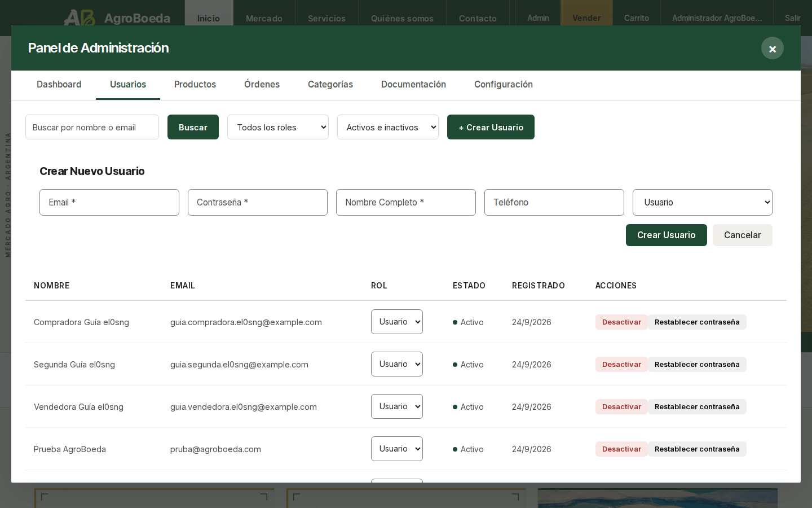

### Paso 5. Desactivar y volver a activar una cuenta
<!-- recorrido: usuarios-desactivar -->

1. En la fila de la cuenta, tocá «Desactivar».
2. El panel pregunta «Desactivar la cuenta» y explica qué va a pasar.
   Confirmá con «Desactivar la cuenta», o tocá «Cancelar».
3. El estado pasa a «Inactivo».

Qué pasa después:

- La persona no puede entrar. Al intentarlo ve «Usuario inactivo. Contacte
  al administrador.».
- Si tenía la sesión abierta, se le corta.
- Sus publicaciones siguen en el Mercado y sus órdenes quedan como estaban.

Para volver a habilitarla, tocá «Activar» y confirmá con «Activar la
cuenta». El estado vuelve a «Activo» y entra con su contraseña de siempre.

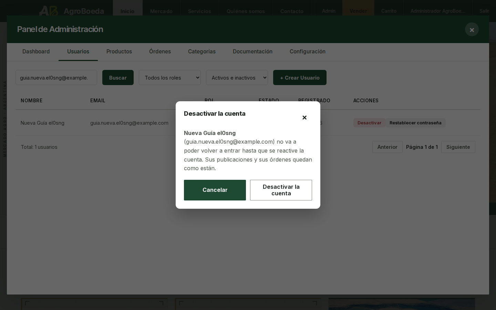

### Paso 6. Restablecer una contraseña
<!-- recorrido: usuarios-clave -->

Sirve cuando alguien no puede entrar porque olvidó la contraseña.

1. En la fila de la cuenta, tocá «Restablecer contraseña».
2. El panel pregunta «Restablecer la contraseña». Confirmá con «Generar
   contraseña nueva».
3. Aparece la ventana «Contraseña nueva de …» con la contraseña.
   **Se muestra una sola vez.** Anotala y tocá «Ya la anoté, cerrar».

Qué pasa después:

- La contraseña anterior deja de funcionar en ese momento.
- La nueva no vence sola: queda hasta que se restablezca otra vez.
- Pasásela a la persona por un medio donde puedas confirmar con quién
  hablás, en persona o por llamada. No la mandes por un chat o un correo que
  quede escrito.

### Paso 7. Dar o quitar acceso de administración
<!-- recorrido: usuarios-rol -->

1. En la columna «Rol» de la fila, cambiá «Usuario» por «Admin».
2. El panel pregunta «Dar acceso de administrador». Confirmá con «Dar acceso
   de Admin».
3. Aparece «Rol actualizado correctamente».

Esa cuenta puede hacer todo lo que explica esta guía. Desde que vuelve a
entrar ve el botón «Admin».

Para quitarle el acceso, cambiá «Admin» por «Usuario». El panel pregunta
«Quitar acceso de administrador». Confirmá con «Pasar a Usuario».

### Paso 8. Lo que no se puede hacer con tu propia cuenta
<!-- recorrido: usuarios-propia -->

- Si tocás «Desactivar» en tu propia fila y confirmás, el panel responde
  «Error al cambiar estado del usuario» y no cambia nada. El motivo es que
  nadie puede desactivar su propia cuenta, aunque el mensaje no lo diga.
- Si cambiás tu propio rol y confirmás, responde «No puedes cambiar tu
  propio rol de administrador».

Para eso hace falta otra persona administradora. Por eso conviene que haya
siempre, por lo menos, dos cuentas de administración.

---

## 4. Productos: las publicaciones

### Paso 9. Ver y filtrar las publicaciones
<!-- recorrido: productos-filtrar -->

La pestaña «Productos» muestra las publicaciones de todas las cuentas, con
«Imagen», «Nombre», «Precio», «Stock», «Vendedor», «Estado» y «Acciones».

Arriba se filtra por estado: «Todos los estados», «Activa», «Pausada»,
«Agotada» o «Eliminada». Abajo, igual que en «Usuarios», dice el total y la
página, con «Anterior» y «Siguiente».

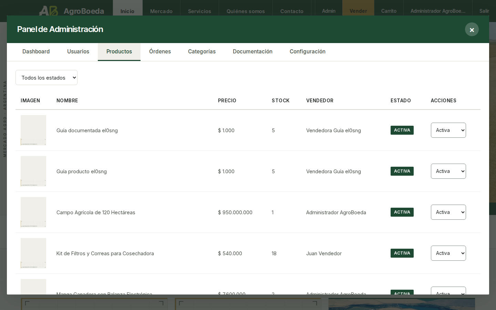

### Paso 10. Pausar una publicación
<!-- recorrido: productos-pausar -->

1. En la columna «Acciones», cambiá el estado a «Pausada».
2. El panel pregunta «Cambiar el estado de la publicación». Explica el
   cambio y avisa que quien vende no recibe aviso. Confirmá con «Pasar a
   Pausada».

Qué pasa después:

- La publicación deja de verse en el Mercado, en las búsquedas y en su
  enlace directo. No se borra.
- Quien vende la ve en «Mis publicaciones» como «Pausado», con el botón
  «Activar». **La puede volver a activar sola.** Pausar no es una sanción.

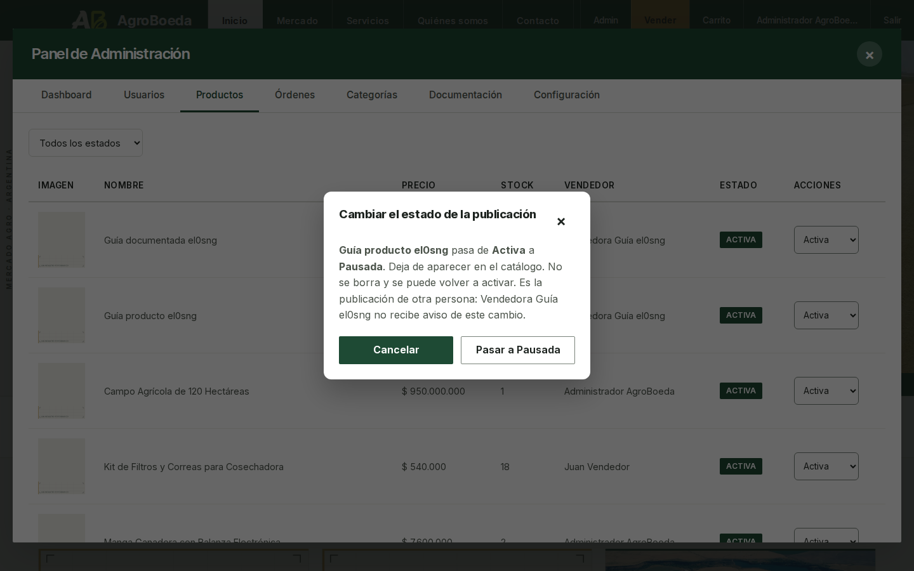

### Paso 11. Volver a activarla
<!-- recorrido: productos-activar -->

Cambiá el estado a «Activa» y confirmá con «Pasar a Activa». La publicación
vuelve a verse en el Mercado.

### Paso 12. Marcarla como agotada
<!-- recorrido: productos-agotada -->

Cambiá el estado a «Agotada» y confirmá con «Pasar a Agotada».

**Cuidado.** El aviso del panel dice «Sigue visible pero no se puede
comprar.», pero hoy no es así:

- la publicación deja de verse en el Mercado y en su enlace, igual que si la
  pausaras;
- quien vende la sigue viendo como «Activo» en «Mis publicaciones».

Está anotado para corregir. Mientras tanto, para sacar una publicación de
circulación usá «Pausada».

### Paso 13. Eliminar una publicación
<!-- recorrido: productos-eliminar -->

Cambiá el estado a «Eliminada» y confirmá con «Pasar a Eliminada».

Qué pasa después:

- La publicación deja de verse en el Mercado y en las búsquedas.
- Desaparece de «Mis publicaciones» de quien vende: no la ve ni tiene un
  botón para volver a activarla.
- En el panel sigue en la lista con el estado «Eliminada». No se borra: si
  hiciera falta, se puede volver a «Activa» y reaparece para todos.

**Cuidado.** Hoy quien vende sí puede volver a activarla con un pedido armado
a mano, sin pasar por la pantalla. Está anotado para corregir. Si reaparece,
eliminala de nuevo.

---

## 5. Órdenes

### Paso 14. Mirar una orden
<!-- recorrido: ordenes-ver -->

1. Abrí la pestaña «Órdenes». Se filtra con «Todos los estados» o con uno
   de los estados de una orden: «Pedido realizado», «Confirmada»,
   «Esperando comprobante», «Comprobante a revisar», «Pagada», «Enviada»,
   «Entregada», «Cancelada» o «Rechazada».
2. La tabla muestra «Orden», «Comprador», «Vendedor», «Items», «Total»,
   «Estado» y «Fecha». Abajo dice el total y la página, con «Anterior» y
   «Siguiente».
3. Tocá «Ver» en una fila. Se abre el detalle con «Información General»,
   «Comprador», «Vendedor», «Productos», «Subtotal:», «Envío:» y «Total:».
4. Cerrá el detalle con «×» o con Escape.

Las órdenes sólo se miran: no hay botones para cambiar su estado ni para
cancelarlas. Los estados los mueven quien compra y quien vende, desde su
cuenta, y el pago por Mercado Pago cuando se acredita.

**Cuidado.** Hoy el detalle no trae todos los datos:

- dice «No hay detalles de items disponibles» aunque la orden tenga
  artículos;
- el correo y la dirección de quien compra aparecen con un guion;
- el subtotal y el envío aparecen en cero.

El total sí es el de la orden. Está anotado para corregir. Mientras tanto, el
detalle completo lo ven quien compra y quien vende en su cuenta.

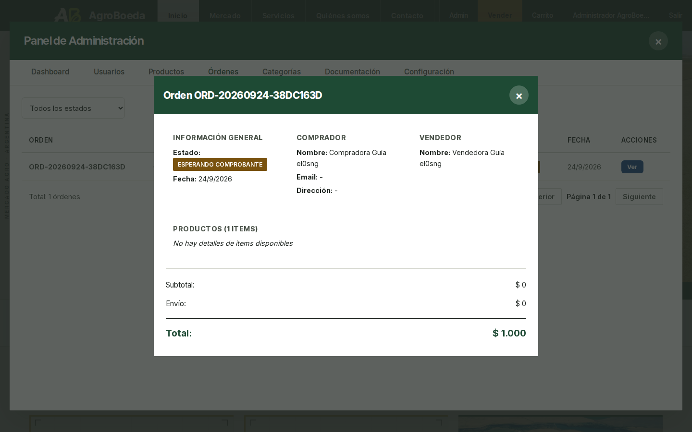
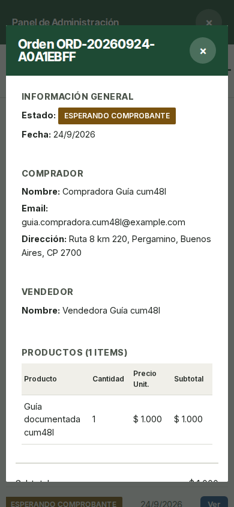

---

## 6. Categorías

Las categorías y subcategorías son las que se eligen al publicar y al
filtrar el Mercado.

### Paso 15. Crear una categoría
<!-- recorrido: categorias-crear -->

1. Abrí la pestaña «Categorías». Arriba se filtra con «Todas», «Solo
   Productos» o «Solo Servicios».
2. Tocá «+ Nueva Categoría».
3. Completá «Nombre *». Son opcionales «Icono (emoji)», «Tipo» («Producto»
   o «Servicio»), «Orden» y «Descripción».
4. Tocá «Crear Categoría», o «Cancelar».

Aparece «Categoría creada exitosamente». La categoría nueva aparece enseguida
en el filtro «Categoría» del Mercado.

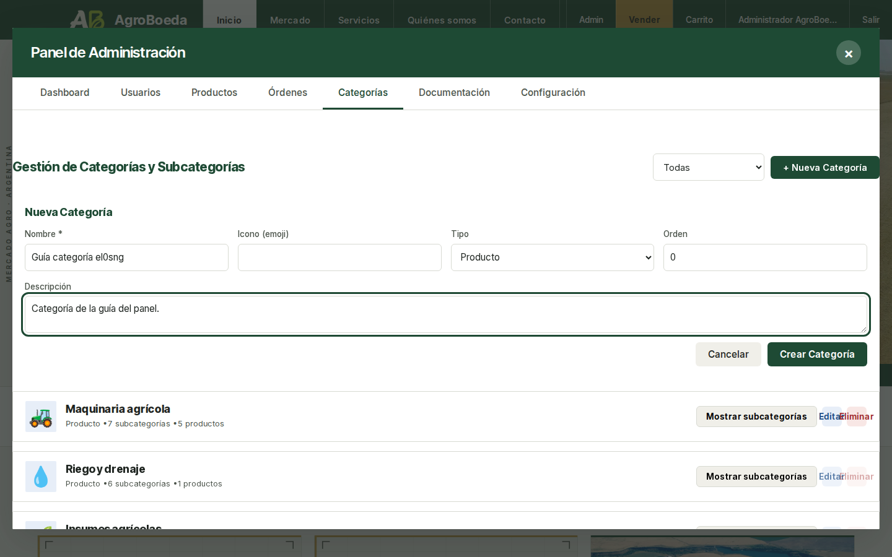

### Paso 16. Agregar una subcategoría
<!-- recorrido: categorias-subcategoria -->

1. En la categoría, tocá «Mostrar subcategorías».
2. Tocá «+ Agregar subcategoría», escribila en «Nombre de subcategoría» y
   tocá «Agregar».

Aparece «Subcategoría agregada». Ya se puede elegir al publicar en esa
categoría. Para cerrar la lista, tocá «Ocultar subcategorías».

### Paso 17. Editar una categoría
<!-- recorrido: categorias-editar -->

1. Tocá «Editar». Se abre «Editar Categoría».
2. Cambiá lo que haga falta y tocá «Guardar Cambios». Aparece «Categoría
   actualizada».

Si la categoría ya tiene publicaciones, el tipo no se puede cambiar. El
panel lo dice: «El tipo no se puede cambiar: … publicación(es) ya se
publicaron bajo esta categoría. El resto sí se edita.».

### Paso 18. Eliminar una subcategoría o una categoría
<!-- recorrido: categorias-eliminar -->

- **Una subcategoría:** tocá «Eliminar» al lado. El panel pregunta
  «Eliminar la subcategoría». Confirmá y aparece «Subcategoría eliminada».
  Sólo se puede si ninguna publicación la está usando.
- **Una categoría:** tocá «Eliminar». El panel pregunta «Eliminar la
  categoría» y avisa que se elimina para siempre. Confirmá y aparece
  «Categoría eliminada». Desaparece del filtro del Mercado.

Una categoría con publicaciones no se puede eliminar: el botón «Eliminar»
queda apagado y, al pasar el puntero, dice «No se puede eliminar: tiene …
publicación(es)».

---

## 7. Documentación de vendedores

Quien vende puede presentar su constancia fiscal desde su cuenta. Acá se
revisa.

### Paso 19. Ver lo que hay para revisar
<!-- recorrido: documentacion-revisar -->

1. Abrí la pestaña «Documentación». Arranca mostrando las «Pendientes»; el
   filtro también ofrece «Aprobadas», «Rechazadas» y «Todas». Al lado dice
   cuántas quedan, como «… pendientes de revisión».
2. La tabla muestra «Vendedor», «CUIT», «Razón social», «Constancia»,
   «Estado», «Presentada» y «Acciones».
3. Para ver el archivo, tocá su nombre en la columna «Constancia». Se abre
   en otra pestaña del navegador.

El panel recuerda que la revisión es manual e informativa: «Revisión manual
e informativa.»

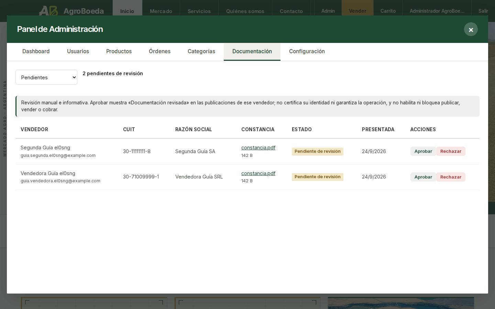

### Paso 20. Aprobar
<!-- recorrido: documentacion-aprobar -->

Tocá «Aprobar». Aparece «Documentación de … aprobada.» y el estado pasa a
«Documentación revisada», con quién la revisó y cuándo.

Qué pasa después: las publicaciones de esa persona muestran «Documentación
revisada». Nada más cambia: podía publicar, vender y cobrar antes, y puede
después.

Si la persona presenta otra constancia, el distintivo se retira hasta que
se revise la nueva.

### Paso 21. Rechazar con un motivo
<!-- recorrido: documentacion-rechazar -->

1. Tocá «Rechazar».
2. Escribí qué tiene que corregir en «Motivo del rechazo». Sin motivo, el
   botón no se habilita.
3. Tocá «Confirmar rechazo», o «Cancelar».

Aparece «Documentación de … rechazada.». Quien vende ve en su cuenta el
estado «Rechazada» y el motivo, bajo «Por qué se rechazó:». Puede presentar
otra constancia cuando quiera.

Una documentación ya decidida dice «Ya revisada» y no se puede volver a
decidir hasta que la persona presente otra.

---

## 8. Configuración: las listas de los formularios

Acá se administran las listas que se eligen al publicar: unidades de medida y
las opciones de los servicios.

### Paso 22. Elegir qué lista mirar
<!-- recorrido: config-tipos -->

Abrí la pestaña «Configuración». Se ve «Configuración de Formularios» y
cuatro listas: «Unidades», «Tipos de Cobro», «Disponibilidad» y «Tiempo de
Respuesta». Al lado del botón dice cuántas opciones tiene la lista, como
«… opciones».

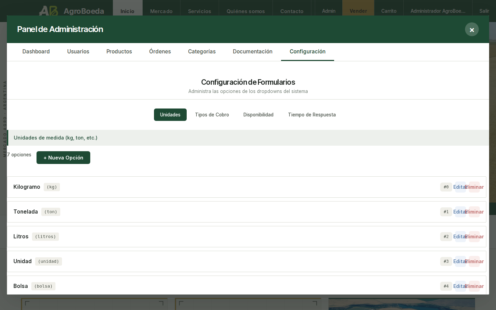

### Paso 23. Agregar una opción
<!-- recorrido: config-crear -->

1. Tocá «+ Nueva Opción». El mismo botón pasa a decir «Cerrar».
2. Completá:
   - «Valor interno (ej: buenos_aires)»: una palabra sin espacios, que
     después no se puede cambiar;
   - «Etiqueta visible (ej: Buenos Aires)»: lo que se ve en el formulario;
   - «Orden»: el lugar en la lista.
3. Tocá «Crear opción».

Aparece «Opción creada exitosamente». Por ejemplo, una unidad nueva aparece
enseguida en «Unidad» al publicar.

### Paso 24. Editar o desactivar una opción
<!-- recorrido: config-editar -->

1. Tocá «Editar» en la opción.
2. Cambiá la etiqueta o el orden. El valor interno queda fijo: es el que
   quedó guardado en las publicaciones.
3. Para dejar de ofrecerla sin borrarla, elegí «Inactivo».
4. Tocá «Guardar», o «Cancelar». Aparece «Opción actualizada».

Una opción «Inactivo» deja de ofrecerse al publicar y queda marcada así en
la lista.

### Paso 25. Eliminar una opción
<!-- recorrido: config-eliminar -->

Tocá «Eliminar». El panel pregunta «Eliminar la opción» y avisa: «Deja de
ofrecerse en los formularios. Las publicaciones que ya la eligieron no
cambian.». Confirmá y aparece «Opción eliminada».

---

## 9. Si una lista no carga

### Paso 26. Volver a pedirla
<!-- recorrido: sin-conexion -->

Si se corta la conexión o el servidor no responde, el panel no muestra una
tabla vacía como si no hubiera nada. Dice qué no pudo cargar, por ejemplo
«No se pudo cargar la lista de usuarios.», con el botón «Reintentar».
Tocalo cuando vuelva la conexión: pide lo mismo otra vez, con los mismos
filtros.

---

## Cómo se comprueba esta guía

Para el equipo técnico: `node scripts/guia-admin.mjs` recorre cada paso en el
navegador, en escritorio y en celular, sobre la base de prueba, y hace lo que
el paso indica. Comprueba tres cosas, y si una no se cumple falla y nombra el
paso:

- **Los textos entre «».** Cada uno aparece en la pantalla durante su paso.
- **Las frases de resultado.** Cada comprobación del programa lleva escrita
  la frase de la guía que describe lo que comprueba. Falla si lo que la frase
  dice no pasa, y también si la frase se cambia o se borra de su paso.
- **El inventario.** Ningún control de las pestañas queda sin nombrar.

Con `--capturas`, además vuelve a generar las imágenes de
`docs/guia-panel-admin/`.

### Lo que el programa no comprueba

Estas frases el recorrido no las puede comprobar. Al lado de cada una dice
de dónde salen. El programa sí comprueba que sigan escritas igual: si una
cambia o se borra, falla y nombra dónde estaba, para que alguien vuelva a
mirar su fuente.

- Antes de empezar: “La plataforma no cobra, no recibe ni guarda dinero de
  las ventas.”, “Quien compra le paga directamente a quien vende, por Mercado
  Pago o por transferencia.” y “nada de ese dinero pasa por AgroBoeda”. Es
  una decisión del proyecto (`docs/pm/DECISIONS.md`, 12/08/2026).
- Paso 2: “Ese dinero fue de quien compró a quien vendió; la plataforma no lo
  recibió.” La misma decisión.
- Antes de empezar: “Las transferencias las confirma quien vende, mirando su
  propia cuenta bancaria.” Sale del código: sólo quien vende puede revisar el
  comprobante (`backend/app/api/orders.py`).
- Antes de empezar: “La revisión de documentación es informativa.” y “No
  habilita ni bloquea publicar, vender ni cobrar”, que comprueba el caso 107
  de `scripts/smoke.mjs`, y “no certifica su identidad”, que es una decisión
  (`DECISIONS.md`, 14/08/2026).
- Paso 20: “Nada más cambia: podía publicar, vender y cobrar antes, y puede
  después.” El caso 107 del smoke.
- Antes de empezar: “quien compra ve el del transportista después de
  elegirlo” y “el transportista no recibe el contacto de quien compra”. Es
  una decisión (`DECISIONS.md`, 05/08/2026) y la comprueban los casos 52 y 54
  del smoke.
- Antes de empezar: “Todavía no existen.”, “El panel no tiene cómo activar
  una suscripción” y “el acceso a contactos por plan no está definido para
  esta etapa”. Es una decisión: los candados de contacto por plan pasan a la
  Fase 6 (`DECISIONS.md`, 05/08/2026).
- Antes de empezar: “lo tiene que hacer otra persona administradora”, y
  Paso 8: “Para eso hace falta otra persona administradora.” Sale del código:
  el panel sólo rechaza los cambios sobre la cuenta propia
  (`backend/app/api/admin.py`).
- Paso 5: “sus órdenes quedan como estaban”. Sale del código: desactivar sólo
  cambia el estado de la cuenta (`admin.py`, `toggle-active`).
- Paso 6: “La nueva no vence sola: queda hasta que se restablezca otra vez.”
  Sale del código: restablecer sólo cambia la contraseña, sin fecha de
  vencimiento (`admin.py`, `reset-password`).
- Paso 14: “Los estados los mueven quien compra y quien vende, desde su
  cuenta, y el pago por Mercado Pago cuando se acredita.” Sale del código
  (`backend/app/api/orders.py` y `backend/app/services/cobro.py`).
- Documentación de vendedores: “Quien vende puede presentar su constancia
  fiscal desde su cuenta.” El caso 108 del smoke.
- Configuración: “unidades de medida y las opciones de los servicios”. Sale
  del código: el formulario de publicar lee esas listas
  (`src/components/AddProduct/AddProductModal.tsx`). Que una unidad nueva
  aparezca al publicar sí se comprueba, en el paso 23.
- Paso 24: “es el que quedó guardado en las publicaciones”, y Paso 25: “Las
  publicaciones que ya la eligieron no cambian.” Sale del código: la
  publicación guarda la opción como texto, no como referencia a la lista
  (`backend/app/models/product.py`).

Tampoco se comprueban los consejos y las notas: para qué sirve un paso, con
quién compartir una contraseña, cuántas cuentas de administración tener, que
pausar no es una sanción o qué está anotado para corregir. Una frase que se
agregue después no se comprueba hasta que se la ate a una comprobación del
programa o se la sume a esta lista.
