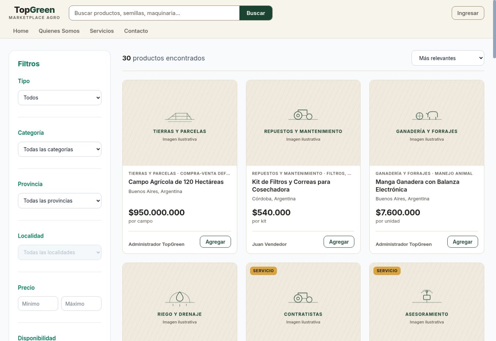

# Puerta 1 — Estrategia de marca

Fecha de investigación: 2026-08-22  
Estado: **aprobada por Emi**  
Territorio aprobado: **La operación a la vista**

## 1. Diagnóstico

UX-1 ordenó el marketplace, pero no construyó una identidad defendible. El
wordmark, la combinación marfil/verde, las ilustraciones repetidas, la
tipografía neutra y las tarjetas equivalentes para objetos comerciales muy
distintos hacen que TopGreen se perciba como una plantilla.

El problema más serio no es estético: una publicación de maquinaria de alto
valor, un insumo estandarizado, un servicio y un transporte no pueden presentar
la misma lógica de compra. Mostrar un campo de USD/ARS alto junto a `Agregar`, o
un servicio a `$0`, resta confianza aunque la pantalla sea prolija.

## 2. Públicos y confianza necesaria

| Público | Contexto de uso | Qué necesita ver antes de avanzar | Riesgo si falta |
|---|---|---|---|
| Comprador | Campo y móvil para descubrir; oficina y desktop para comparar/cerrar | Precio o modalidad, condición, ubicación, datos técnicos, identidad del vendedor y próximo paso | Una operación de alto valor parece una publicación informal |
| Vendedor | Concesionario, empresa, productor o prestador; carga y seguimiento de contactos | Qué dato falta, cómo se presenta, calidad del contacto y alcance de la publicación | Publicaciones incompletas y consultas sin contexto |
| Transportista | Evalúa distancia, carga, equipo, cobertura y disponibilidad | Origen/destino, tipo de carga, dimensiones/peso, radio de cobertura y mecanismo de cotización | Promesas imposibles o cotizaciones inútiles |

La confianza no puede descansar en un color, un escudo o una etiqueta. Tiene
que surgir de datos verificables, autoría clara, actualización, condiciones y
un proceso comprensible. TopGreen no debe decir `verificado`, `protegido`,
`inspeccionado` o `garantizado` sin una operación real que respalde cada término.

## 3. Posicionamiento

**TopGreen es el marketplace agro que organiza productos, servicios y
logística como operaciones claras, para que cada parte sepa qué se ofrece,
quién interviene y qué sigue.**

## 4. Promesa

**Antes de avanzar, lo importante está a la vista.**

No promete eliminar el riesgo ni garantizar la transacción. Promete ordenar y
hacer visible la información necesaria para decidir el próximo paso.

## 5. Personalidad

| Atributo | Significa | No significa |
|---|---|---|
| Operativa | Ayuda a decidir y actuar | Grandilocuente o institucional |
| Precisa | Nombra datos, estados y condiciones | Sobrecarga técnica ni jerga vacía |
| Transparente | Expone alcance y límites | Simula seguridad que el producto no ofrece |
| Sobria | Reduce ruido y prioriza evidencia | Lujo vacío, frialdad o minimalismo improductivo |
| Cercana al oficio | Entiende la realidad del trabajo agro | Folklórica, costumbrista ni llena de clichés rurales |

## 6. Arquitectura verbal

- Nombre mostrado: **TopGreen**.
- Descriptor: **Mercado agro: productos, servicios y logística.**
- Tono: directo, factual, sereno y específico.
- Titulares posibles: `Tractores usados en Buenos Aires`, `Servicios con
  cobertura declarada`, `Precio, estado y ubicación antes de consultar`.
- Acciones por operación:
  - maquinaria y activos de alto valor: `Consultar al vendedor` y
    `Ver condiciones`;
  - insumos estandarizados: `Agregar`;
  - servicios: `Solicitar cotización`;
  - logística: `Ver cobertura` o `Ver transportistas`.

Titulares prohibidos: `El futuro del agro`, `Conectamos oportunidades`,
`Transformamos el campo` y cualquier variante intercambiable con otra agtech.

## 7. Territorio diferenciador

### La operación a la vista

TopGreen no debe competir por parecer más verde ni más tecnológica. Su activo
propio es representar cada oferta como una operación concreta: objeto o
servicio, partes, lugar, condición, evidencia disponible y próximo paso.

Este territorio permite integrar maquinaria, campos, insumos, ganado,
servicios y logística sin fingir que todos son artículos de carrito. También se
puede internacionalizar porque se apoya en información operativa, no en códigos
folklóricos argentinos.

## 8. Evidencia de mercado

| Referencia | Lección útil | Qué no debe copiar TopGreen |
|---|---|---|
| [Agrofy](https://www.agrofy.com.ar/) | Taxonomía local, vocabulario del sector y publicación orientada a consulta | Saturación promocional y dependencia del verde agro |
| [Mercado Libre — Compra Protegida](https://www.mercadolibre.com.ar/compra-protegida) y [reputación](https://www.mercadolibre.com.ar/ayuda/Como-funciona-la-reputacion-de-vendedor_4024) | La confianza se convierte en mecanismos y evidencia visibles | Paleta, reputación y promesas que TopGreen todavía no opera |
| [Agroads](https://www.agroads.com.ar/) | Densidad, categorías y lenguaje agro argentino | Apariencia anticuada y acumulación de información sin jerarquía |
| [Agriaffaires](https://www.agriaffaires.es/usado/tractores-agricolas/1/4039/john-deere.html) | Filtros técnicos, localización y comparación internacional | Convertir la interfaz en una planilla sin identidad |
| [TractorHouse](https://www.tractorhouse.com/) / [MachineryTrader](https://www.machinerytrader.com/) | Datos de equipo, vendedor y alcance geográfico | Estética de clasificado industrial como identidad completa |
| [E-FARM](https://e-farm.com/en/buying-used-farm-machinery-abroad/) | La internacionalización exige proceso, transporte y condiciones explícitas | Copiar claims de inspección o garantía sin infraestructura equivalente |

Las capturas de competidores se usaron como evidencia durante la sesión y no se
incorporaron al repositorio por no existir una licencia de redistribución
comprobada. La única captura persistida es del despliegue propio de TopGreen.

