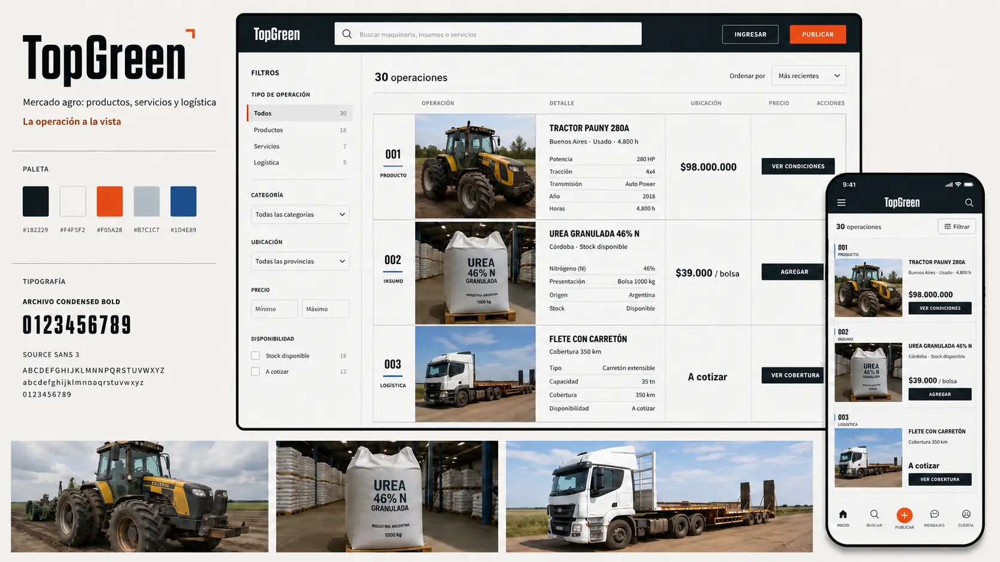
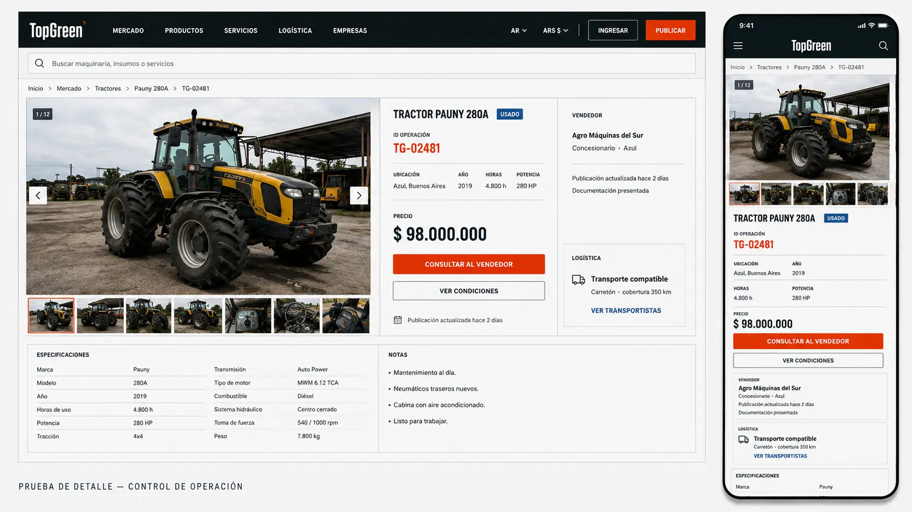
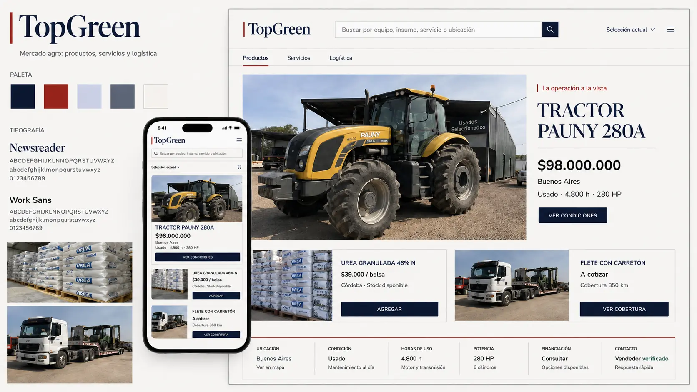
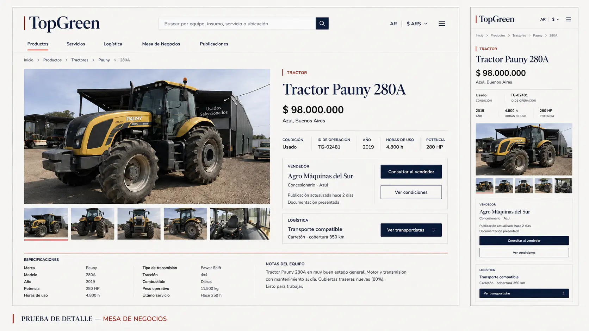

# Puerta 2 — Direcciones visuales comparables

Fecha: 2026-08-22  
Estado: **pendiente de elección de Emi**  
Decisión requerida: **A — Control de operación** o **B — Mesa de negocios**

Las láminas son pruebas conceptuales desktop/mobile. No son logos finales,
pantallas para implementar ni fotografías aptas para el producto.

## Regla compartida de producto

La identidad visual puede variar, pero la anatomía debe responder al tipo de
operación:

- maquinaria o activos de alto valor: `Consultar al vendedor` / `Ver condiciones`;
- insumos estandarizados: `Agregar`;
- servicios: `Solicitar cotización`;
- logística: `Ver cobertura` / `Ver transportistas`.

Esta regla no es un híbrido estilístico. Es una consecuencia directa del
territorio aprobado, **La operación a la vista**.

## Dirección A — Control de operación

### Concepto

TopGreen funciona como una sala de operaciones agro. El carácter premium surge
de precisión, orden y evidencia: registros numerados, reglas duras, datos
alineados y estructuras específicas para cada operación.

### Identidad

- Wordmark tipográfico condensado y oscuro.
- Un mínimo gesto de registro naranja puede acompañarlo.
- No se propone símbolo figurativo en esta etapa.
- Prohibidos hoja, brote, tractor, globo, apretón de manos o circuito.

El tratamiento mostrado es una hipótesis, no un logo aprobado.

### Tipografía y licencia

- [Archivo](https://fonts.google.com/specimen/Archivo) para identidad y títulos;
  [licencia OFL](https://github.com/google/fonts/blob/main/ofl/archivo/OFL.txt).
- [Source Sans](https://github.com/adobe-fonts/source-sans) para interfaz y
  lectura de datos; [licencia OFL](https://github.com/adobe-fonts/source-sans/blob/release/LICENSE.md).

### Paleta y contraste

| Rol | Color | Contraste probado |
|---|---|---:|
| Fondo mineral | `#F4F5F2` | — |
| Texto hierro | `#182229` | 14.77:1 sobre fondo |
| Fondo hierro | `#182229` | blanco 16.16:1 |
| Acción azul | `#1D4E89` | blanco 8.39:1 |
| Señal naranja | `#F05A28` | texto hierro 4.77:1 |
| Acento accesible | `#BA3D18` | blanco 5.57:1; sobre fondo 5.09:1 |

`#F05A28` sobre `#F4F5F2` da 3.10:1 y queda prohibido para texto normal. Sólo
puede usarse como señal no textual o como fondo con texto hierro. Los ratios se
evaluaron contra [WCAG 2.2](https://www.w3.org/WAI/WCAG22/Understanding/contrast-minimum).

### Fotografía

- Encuadre documental, frontal o tres cuartos; escala y contexto visibles.
- Luz realista, suciedad y desgaste cuando correspondan.
- Personas sólo trabajando, inspeccionando o negociando; nunca posando como
  stock corporativo.
- Prohibidos renders flotantes, campos genéricos de atardecer y maquinaria
  generada como activo final.

### Voz y microcopy

Breve, operacional y verificable: `ID de operación`, `Publicación actualizada
hace 2 días`, `Documentación presentada`, `Transporte compatible`.

No usar `verificado`, `seguro`, `protegido`, `certificado`, `inspeccionado` o
`garantizado` si la plataforma no registra la evidencia correspondiente.

### Fortalezas

- Es la dirección más propia y eficiente.
- Soporta catálogos densos y comparación rápida.
- Escala internacionalmente sin depender de códigos locales.
- Su premium proviene del sistema, no de efectos decorativos.

### Riesgos adversariales

- Puede parecer un concesionario industrial o un SaaS logístico.
- El wordmark condensado roza el cliché de maquinaria pesada.
- La frialdad y la densidad pueden castigar categorías humanas como campos,
  genética o servicios.
- Mobile exige una transformación rigurosa de tabla a secciones apiladas.

### Costo estimado

**Medio.** Requiere nuevas anatomías de publicación y reglas responsive, pero
puede realizarse con el stack actual y sin dependencias visuales opacas.

## Dirección B — Mesa de negocios

### Concepto

Una publicación comercial agropecuaria con autoridad editorial que también
funciona como mesa de negociación. El carácter premium surge de criterio,
fotografía, jerarquía y serenidad, no de lujo vacío.

### Identidad

- Wordmark serif editorial en índigo y regla vertical roja.
- No se propone isotipo en esta etapa.
- El tratamiento mostrado es una hipótesis y puede descartarse si parece una
  casa de subastas o una marca de lujo.

### Tipografía y licencia

- [Newsreader](https://fonts.google.com/specimen/Newsreader) para títulos e
  identidad; [licencia OFL](https://github.com/google/fonts/blob/main/ofl/newsreader/OFL.txt).
- [Work Sans](https://fonts.google.com/specimen/Work%2BSans) para interfaz y
  datos; [licencia OFL](https://github.com/google/fonts/blob/main/ofl/worksans/OFL.txt).

### Paleta y contraste

| Rol | Color | Contraste probado |
|---|---|---:|
| Fondo porcelana | `#F8F7F3` | — |
| Texto índigo | `#17213D` | 14.83:1 sobre fondo |
| Fondo índigo | `#17213D` | blanco 15.89:1 |
| Texto secundario | `#667085` | 4.64:1 sobre fondo; no aclarar más |
| Azul grisáceo | `#D8DEEA` | índigo 11.77:1 |
| Bermellón accesible | `#B93424` | 5.47:1 sobre fondo; blanco 5.87:1 |

El bermellón explorado inicialmente, `#E04A2F`, falló para texto normal
(3.77:1) y se descartó. Ratios evaluados contra WCAG 2.2.

### Fotografía

- La operación real es la evidencia principal, con una imagen protagonista y
  detalles secundarios.
- Encuadres humanos, territoriales o mecánicos según la categoría.
- La imagen nunca reemplaza precio, estado, ubicación, autoría o condiciones.
- Prohibidos banco de imágenes corporativo, poses de apretón de manos,
  monocultivo idílico genérico y escenas generadas como activo final.

### Voz y microcopy

Serena y editorial, pero concreta. Los títulos nombran el objeto y los datos;
no prometen `revolucionar`, `conectar el futuro` ni `transformar el agro`.

### Fortalezas

- Es la alternativa con mayor percepción premium inmediata.
- Da autoridad a campos, genética, servicios e insumos, no sólo a maquinaria.
- Construye una relación más humana con el vendedor y el territorio.
- Puede generar una identidad reconocible sin recurrir al verde agro.

### Riesgos adversariales

- Está a un paso del `Behance editorial`: serif elegante, foto enorme y poca
  eficiencia comercial.
- Puede parecer una revista o casa de subastas.
- Una operación destacada puede percibirse como contenido pago o arbitrario.
- Todavía debe probar que soporta cien resultados, filtros complejos y
  comparación rápida sin perder jerarquía.
- Requiere gobierno fotográfico y de contenidos mucho más costoso.

### Costo estimado

**Medio-alto.** Exige composiciones responsive nuevas, ratios fotográficos,
criterios de selección para destacados y control de calidad editorial.

## Comparación y recomendación profesional

| Criterio | A — Control de operación | B — Mesa de negocios |
|---|---|---|
| Premium inmediato | Medio-alto | Alto |
| Diferenciación defendible | Alta | Media-alta |
| Densidad de catálogo | Alta | A demostrar |
| Amplitud de categorías | Media | Alta |
| Escala internacional | Alta | Alta |
| Riesgo principal | Frialdad industrial | Editorialismo improductivo |
| Costo | Medio | Medio-alto |

**Lectura adversarial:** B es hoy la candidata más premium visualmente; A es
más propia, robusta y escalable como producto. No se recomienda un híbrido
50/50: diluiría ambos conceptos y volvería a una identidad de plantilla.

## Decisión pendiente

Emi debe elegir una sola dirección:

- **A — Control de operación**, con la condición de humanizarla y demostrar
  categorías no mecánicas; o
- **B — Mesa de negocios**, con la condición de demostrar un catálogo denso
  antes de aprobar el sistema.

Hasta esa elección, la Puerta 2 permanece abierta y no corresponde iniciar
logos finales, sistema visual, implementación ni handoff a la Dev.
