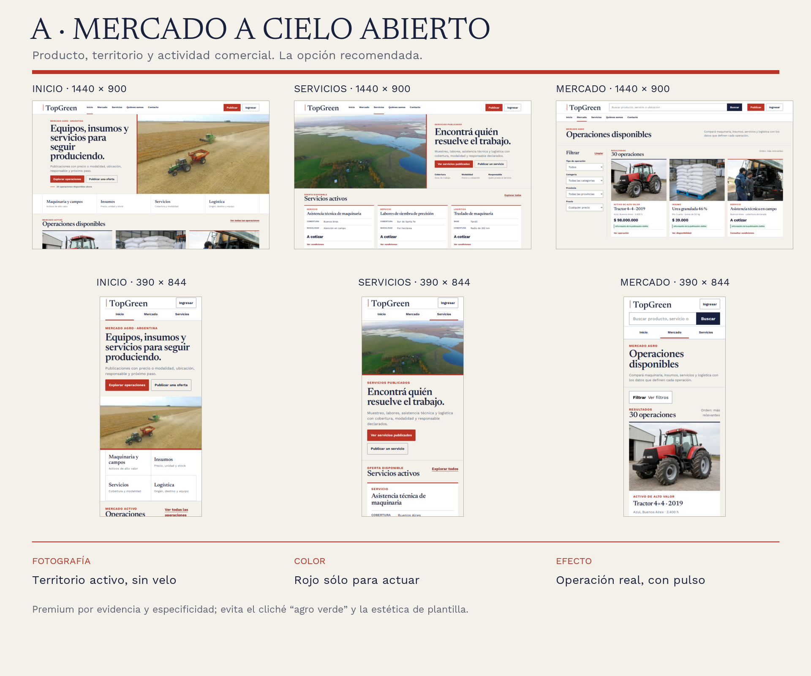
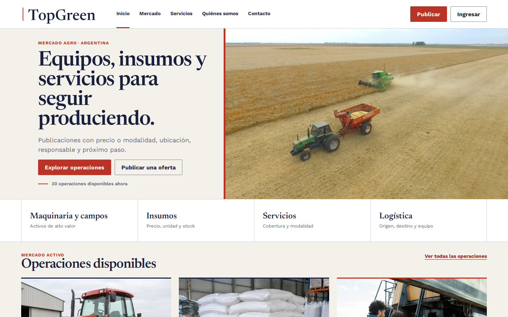
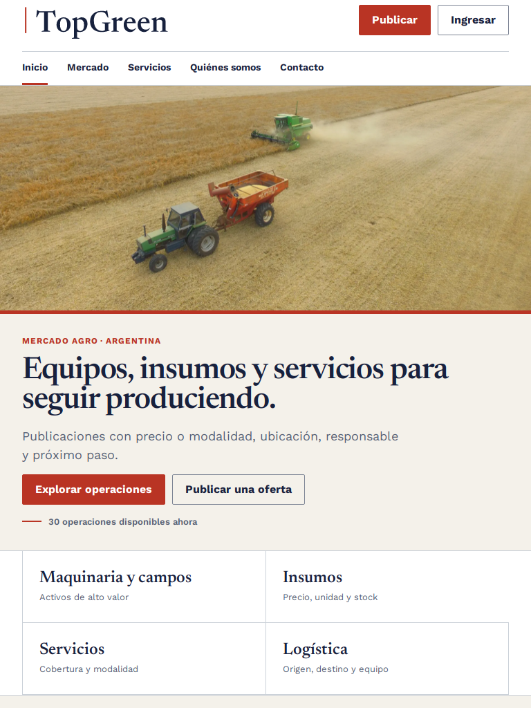
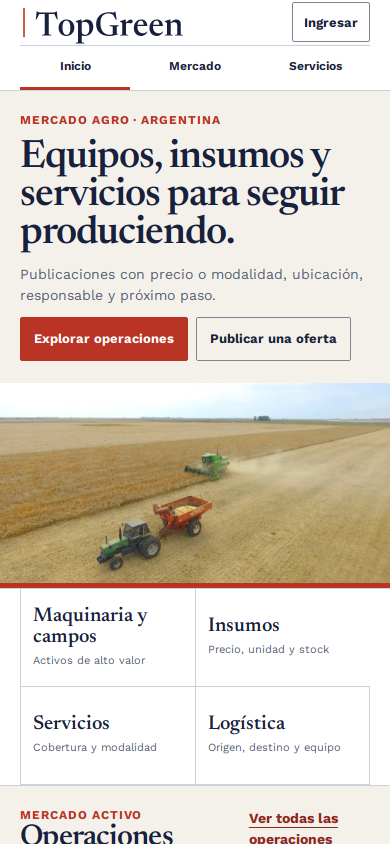
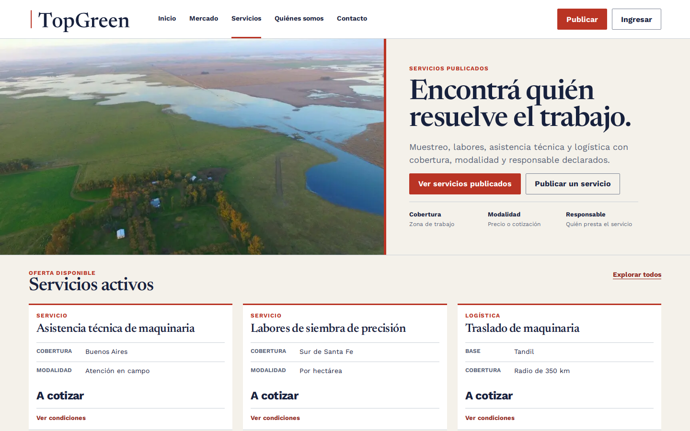
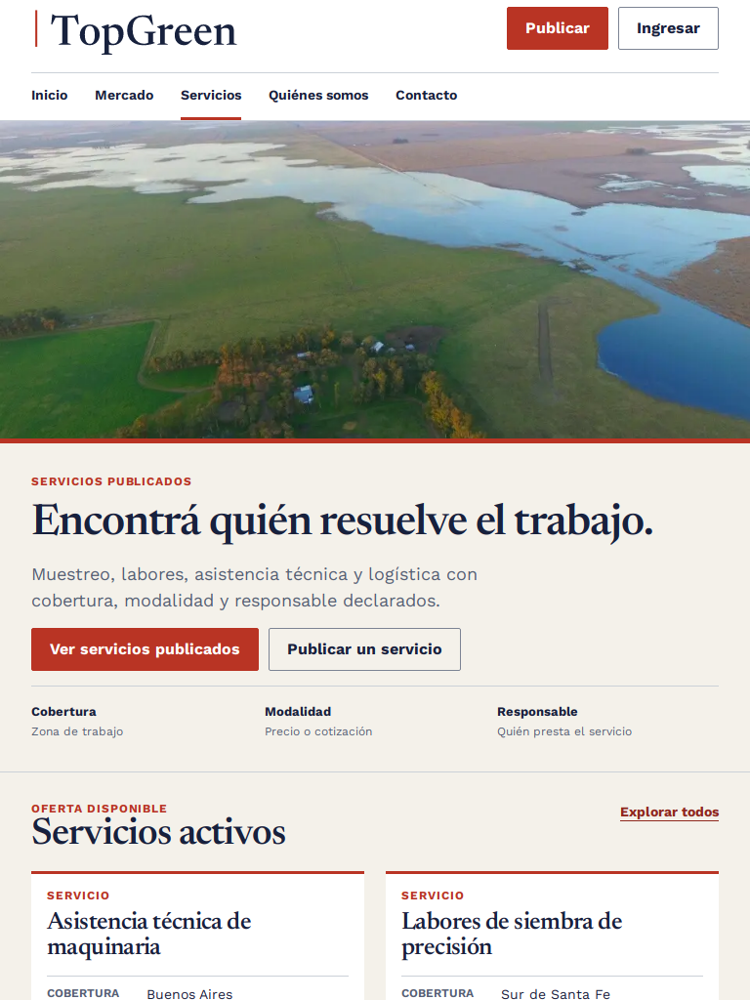
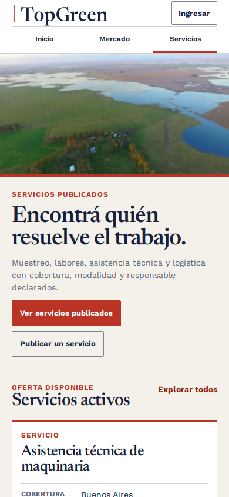
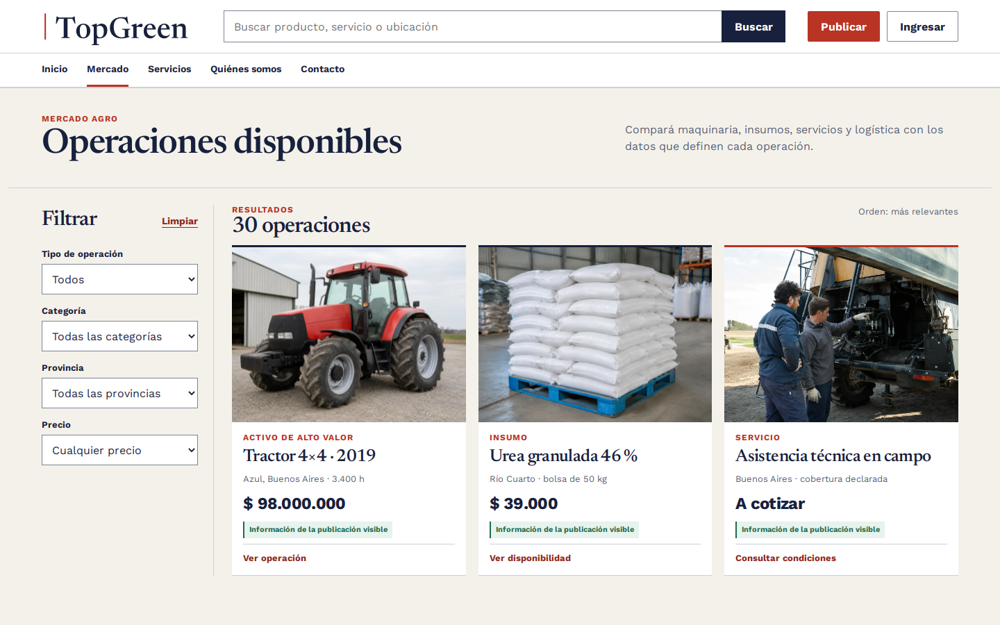
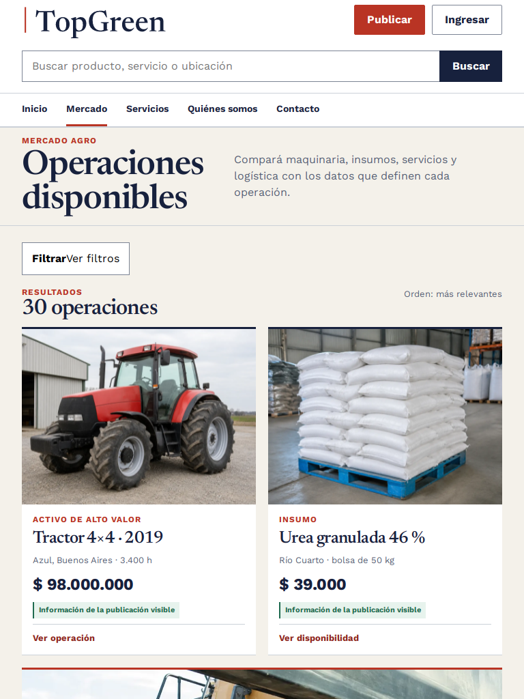
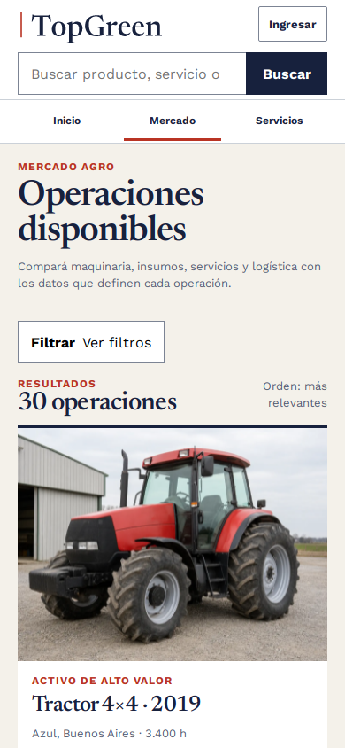

# Presentación final — A / Mercado a cielo abierto

Estado: **aprobada por Emi y entregada a Dev**.

## Inicio

| Desktop | Tablet | Mobile |
|---|---|---|
|  |  |  |

Página completa: [desktop](./pantallas/inicio-a-full-1440.png) ·
[mobile](./pantallas/inicio-a-full-390.png)

## Servicios

| Desktop | Tablet | Mobile |
|---|---|---|
|  |  |  |

Página completa: [desktop](./pantallas/servicios-a-full-1440.png) ·
[mobile](./pantallas/servicios-a-full-390.png)

## Mercado

| Desktop | Tablet | Mobile |
|---|---|---|
|  |  |  |

## Decisiones que sostienen lo premium

1. La fotografía demuestra territorio/actividad y nunca recibe texto ni
   overlay.
2. El producto y sus datos aparecen en Inicio; no hay beneficios corporativos
   inventados.
3. Servicios compara cobertura/modalidad/responsable; no promete consultoría de
   IA o satélites.
4. El rojo sólo marca acción y orientación comercial; el índigo estructura.
5. Las cards mantienen anatomías reales y fallbacks; no se convierten en una
   plantilla universal.
6. B queda como evidencia de descarte, no como tema alternativo.

## Qué recibe Dev

- prototipos HTML/CSS ejecutables;
- tokens y contraste;
- copy exacto y estados;
- reglas responsive en tres viewports;
- mapa a archivos/componentes reales;
- cuatro activos web permitidos, hashes y prohibiciones;
- checklist de paridad y auditoría axe 9/9;
- tarea activa en `docs/pm/PARA-DEV.md`.

El único faltante comercial no delegado a Dev es producir la fotografía final
de asistencia técnica para reemplazar el hero interino de Servicios.
