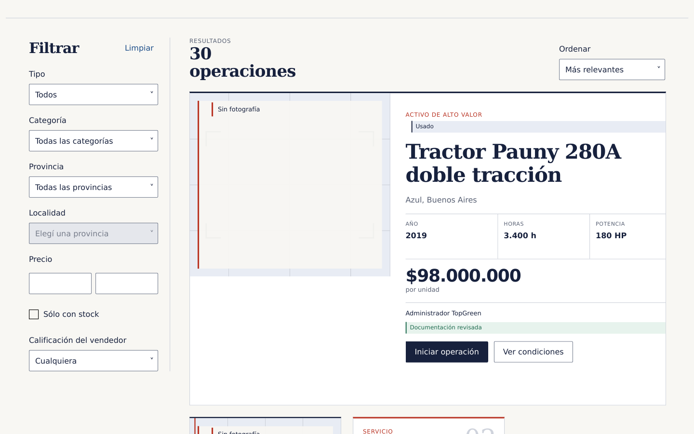
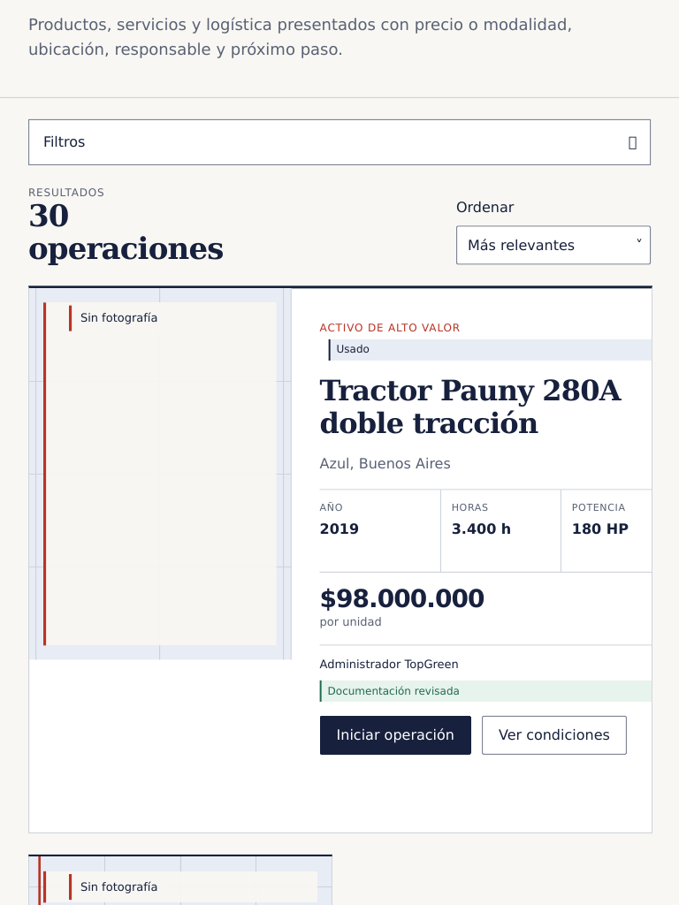
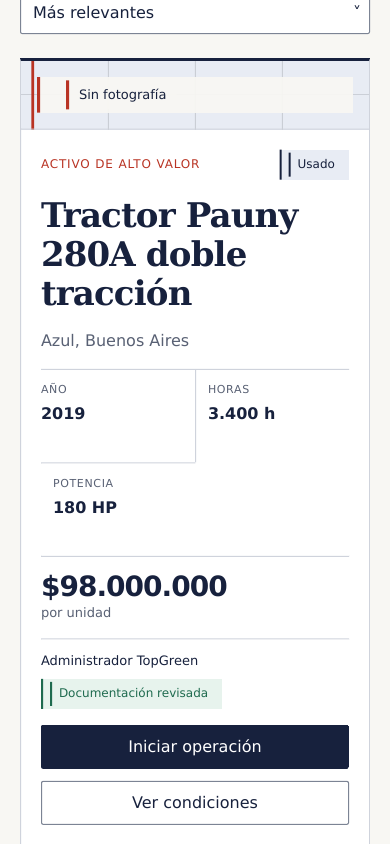
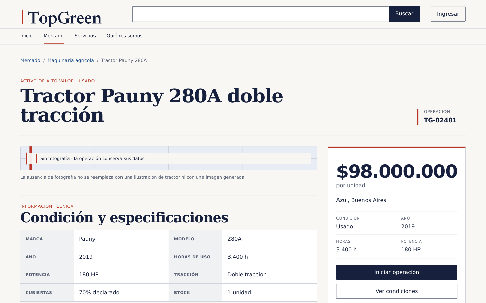
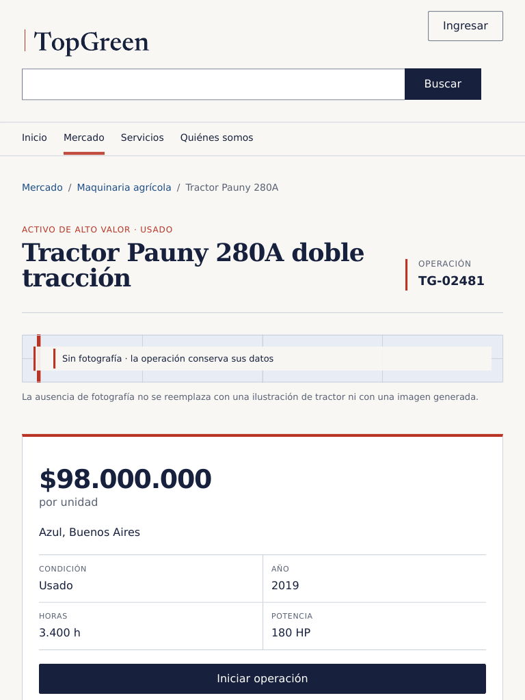
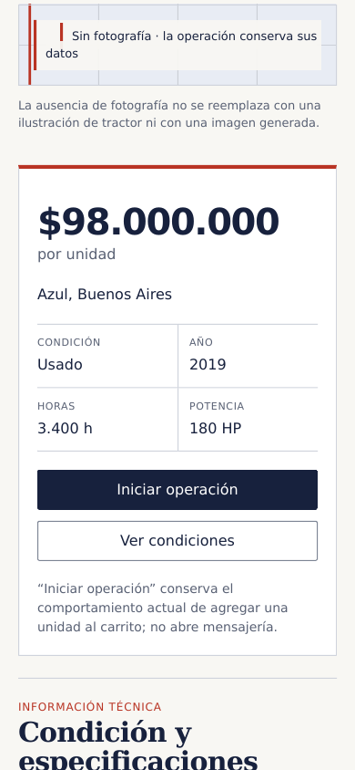
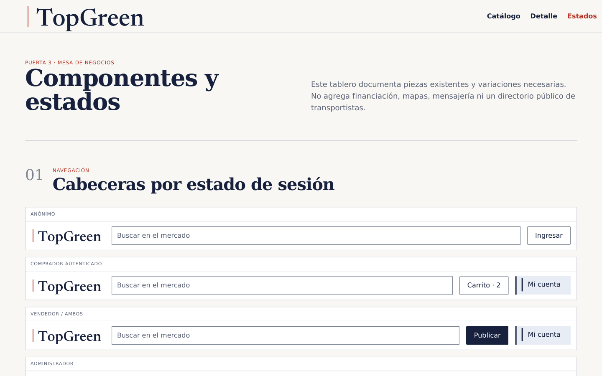
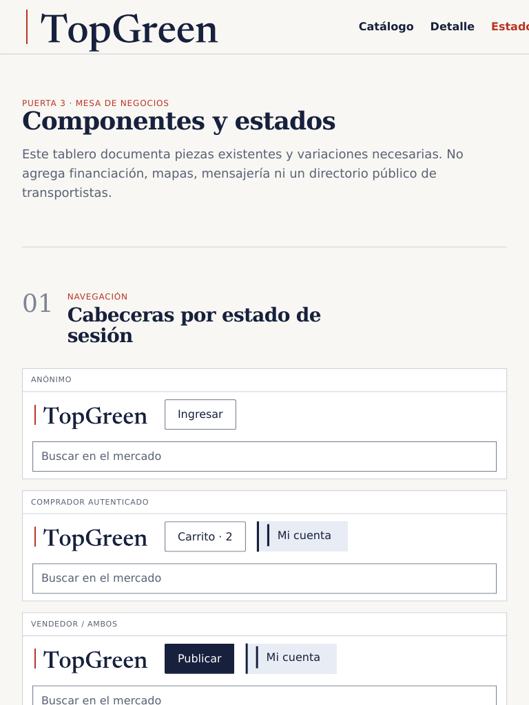
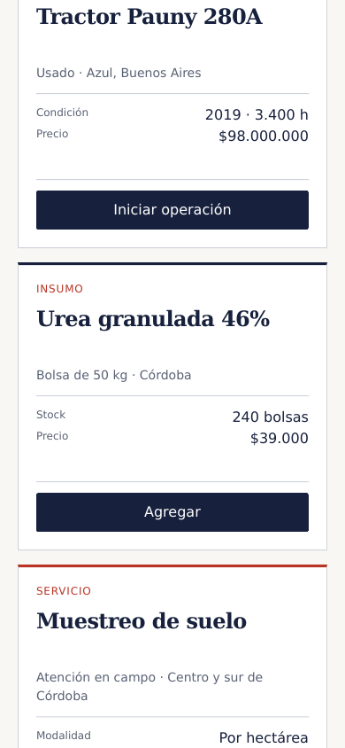

# Presentación a Emi y PM — Puerta 3

**Dirección:** B — Mesa de negocios
**Decisión solicitada:** aprobar, devolver o recortar este handoff.
**Estado de desarrollo:** pausado. No entregar a Opus antes de aceptación de los
seis puntos y commit aprobado en `main`.

## 1. Wordmark final

- Sistema final: `IDENTIDAD.md`.
- Archivos: horizontal, compacto, monocromo claro y oscuro en
  `assets/wordmark/`.
- Decisión adversarial: no hay hoja, monograma `TG` ni favicon inventado. La
  regla bermellón firma el lockup, pero no funciona sola como símbolo.

**Evaluar:** legibilidad, autoridad, singularidad y reglas de uso.

## 2. Catálogo y detalle en tres viewports

- Fuente: `marketplace.html`, `detalle.html` y CSS asociado.
- Evidencia: `capturas/` en 1440×900, 768×1024 y 390×844.
- Catálogo denso, sin mosaico genérico; detalle con resumen de operación y ficha
  técnica; ambos funcionan con fallback en vez de depender de una foto hero.

**Evaluar:** jerarquía, densidad, operación y responsive.

| 1440×900 | 768×1024 | 390×844 |
|---|---|---|
|  |  |  |

| 1440×900 | 768×1024 | 390×844 |
|---|---|---|
|  |  |  |

## 3. Cuatro anatomías

- Especificación: `ANATOMIAS.md`.
- Evidencia compacta: `estados.html`.
- Alto valor, insumo, servicio y logística tienen datos y acciones diferentes.
  No se usa una card universal que disimule diferencias de negocio.

**Evaluar:** obligatoriedad/ausencia de datos y acción correcta por tipo.

## 4. Tablero de componentes y estados

- Fuente: `estados.html` y `estados.css`.
- Incluye cabeceras por rol, botones, filtros, campos, upload, cards, detalle,
  modal/drawer, tabs, tabla, toast, footer y estados límite/interaction.
- Las piezas futuras están separadas en `FUTURO-NO-IMPLEMENTAR.md`.

**Evaluar:** cobertura, consistencia, accesibilidad y estados negativos.

| Tablero desktop | Tablero tablet | Anatomías mobile |
|---|---|---|
|  |  |  |

## 5. Activos y licencias

- `ACTIVOS.md`: inventario, medidas, pesos máximos, procedencia, licencias y
  hashes.
- `FOTOGRAFIA.md`: criterio de evidencia, crop, calidad y prohibiciones.
- No se incluye fotografía demo: no hay todavía un set con licencia y
  aprobación trazables. No se reciclan conceptuales de Puerta 2.

**Evaluar:** trazabilidad y suficiencia para producción sin temporales.

## 6. Prototipos y mapa de implementación

- Prototipos aislados: `marketplace.html`, `detalle.html`, `estados.html`.
- Tokens: `TOKENS.md` + `tokens.css`; copy: `COPY.md`.
- Mapeo al repo real: `MAPA-COMPONENTES.md`.
- Aceptación posterior: `PARIDAD.md`.

El mapa conserva las funciones reales. `Iniciar operación` usa carrito/checkout;
`Ver transportistas` existe sólo dentro del checkout con destino; una
cotización por publicación no se finge.

**Evaluar:** que Opus pueda implementar sin inventar producto ni copiar una
captura a ojo.

## Corte adversarial

No aprobar si ocurre cualquiera de estos puntos:

- se percibe como un marketplace genérico recoloreado;
- una afirmación de confianza no está respaldada por dato;
- las cuatro operaciones se comportan igual;
- una captura contradice tokens o reglas;
- falta un estado negativo o se oculta contenido en mobile;
- un activo no tiene procedencia y licencia.

## Registro de decisión

| Revisor | Resultado | Alcance / devolución | Fecha |
|---|---|---|---|
| Emi | Aprobado para versionar | Autorizó subir el paquete completo al repo; no autoriza todavía entrega a Opus. | 2026-08-23 |
| PM | Pendiente | — | — |

Resultado conjunto: **pendiente de PM**. El paquete puede quedar versionado en
`main`, pero no pasa a Opus ni autoriza implementación.
